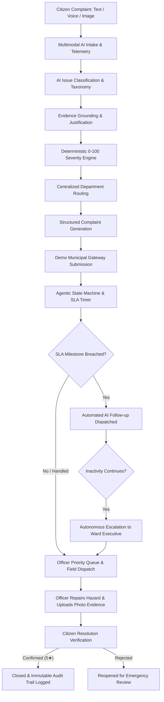

# ⚡ CivicFlow: AI-Powered Smart Civic Issue Resolution Agent

> **Tagline**: *Report. Route. Resolve.*  
> **Repository**: [https://github.com/vasundharabagal/civicflow](https://github.com/vasundharabagal/civicflow)  
> **Architecture**: Multimodal AI Triage • Deterministic 0–100 Severity Scoring • Configurable Department Mapping • Agentic State Machine • SLA Monitoring • Auto Follow-Up & Escalation • Citizen Resolution Verification • Immutable Audit Trail

---

## 🏛️ Executive Summary

**CivicFlow** transforms traditional passive municipal complaint portals into an autonomous, proactive **Smart Civic Issue Resolution Agent**. Instead of routing complaints into bureaucratic black holes, CivicFlow uses multimodal AI intelligence to evaluate photographic and textual telemetry, deterministically compute severity, ground evidence, enforce strict SLA countdowns, and execute autonomous follow-up and escalation when municipal authorities stall.



---

## 🏆 Hackathon Evaluation Mapping

| Hackathon Metric | CivicFlow Implementation |
| :--- | :--- |
| **Issue Classification Accuracy** | Multimodal classification + domain taxonomy (Open Manhole, Pothole, Road Damage, Garbage, Water Leak, Sewage Overflow, Streetlight, Fallen Tree, Electric Spark) with confidence scoring. |
| **Department Mapping Accuracy** | Configurable, deterministic department mapper routing complaints based on municipal civil engineering jurisdictions. |
| **Severity Assessment** | Weighted 0–100 deterministic severity scoring engine based on Base Risk (0–30), Immediate Hazard (0–25), Population/Traffic Impact (0–15), Infrastructure Importance (0–10), Sensitive Location (0–10), Repeat Reports (0–5), and Duration (0–5). |
| **Agentic Workflow Execution** | 14-state machine (`DRAFT`, `ANALYZING`, `SUBMITTED`, `ACKNOWLEDGED`, `ASSIGNED`, `IN_PROGRESS`, `RESOLUTION_REPORTED`, `RESOLVED`, `REOPENED`, `FOLLOW_UP_PENDING`, `ESCALATED`, `CLOSED`) with autonomous SLA timers, automated follow-ups, and hierarchical escalation. |
| **Evidence Grounding** | Grounded evidence bullet points extracting physical observations from user photos, geolocation telemetry, and text without generative hallucinations. |
| **Practical Usability** | 4 dedicated, responsive interfaces: Citizen Reporting & Tracking, Officer Priority Dispatch, Admin Analytics & GIS Map, and Interactive Judge Demo. |

---

## 🎯 Key Features & Differentiators

### 1. Multimodal Intake & Voice Telemetry
- **Text & Voice Complaint Capture**: Live simulated voice transcription alongside detailed text description.
- **Visual Evidence Ingestion**: Real-time photographic upload with instant detection tags.
- **GIS Geolocation Telemetry**: Interactive Leaflet OpenStreetMap pin dragging, GPS locator, and vulnerable zone tagging (School / Hospital / Transit Hub).

### 2. Deterministic 0–100 Severity Engine
Unlike opaque LLM wrappers that guess arbitrary scores, CivicFlow calculates severity using an explainable, deterministic point matrix:
- **Base Issue Risk (0–30)**: Inherent civil danger (e.g. Open Manhole = 30, Electric Spark = 28, Pothole = 20, Garbage = 15).
- **Immediate Safety Hazard (0–25)**: Direct fall, skid, collision, or electrocution risk.
- **Population / Traffic Impact (0–15)**: Arterial roads, pedestrian density, market areas.
- **Infrastructure Importance (0–10)**: Major transit thoroughfares, conduits, bridges.
- **Sensitive Location (0–10)**: Proximity to schools, hospitals, kindergartens.
- **Repeat Corroborations (0–5)**: Corroborating reports from neighboring citizens (+2 per report).
- **Issue Duration (0–5)**: Ongoing timeline duration.

**Severity Levels & SLAs:**
- `0–25 LOW`: 120-hour (5 days) response threshold.
- `26–50 MEDIUM`: 72-hour (3 days) response threshold.
- `51–75 HIGH`: 24-hour (1 day) response threshold.
- `76–100 CRITICAL`: 4-hour emergency response threshold.

### 3. Duplicate Detection & Citizen Corroboration
- Evaluates Haversine geographic distance (< 300m), category match, time overlap (< 72h), and text similarity.
- Allows citizens to **"Support Existing Complaint"** rather than spamming municipal queues, boosting the complaint's supporter count and urgency score.

### 4. Agentic State Machine & Immutable Audit Trail
- Enforces strict lifecycle state transitions, rejecting illegal state shifts.
- Every single automated or manual action logs an immutable event (`action`, `actor`, `timestamp`, `reason`, `old_status`, `new_status`, `evidence_references`, `metadata`).
- Actors tracked: `CITIZEN`, `AI_AGENT`, `SYSTEM`, `OFFICER`, `ADMIN`.

### 5. Demo Municipal Gateway
- Integrated `MockMunicipalAdapter` implementing the `AuthorityAdapter` protocol.
- Generates official municipal receipt IDs (e.g., `MCGM-2026-X8841`) and simulates bidirectional government gateway status receipts.

### 6. Interactive Leaflet GIS Map & Heatmap
- Visualizes all municipal incidents with color-coded severity markers (Red = Critical, Orange = High, Yellow = Medium, Green = Low).
- Filters by department and severity.
- **Privacy-guarded**: Public map markers omit private citizen names, phone numbers, and sensitive contact info.

---

## ⚡ Hackathon Demo Mode (`/demo`)

CivicFlow includes a dedicated **Judge Demo Mode** designed for rapid, step-by-step hackathon judging of the primary scenario:

### Primary Scenario: *Open Manhole near School on Busy Road*
1. **`1. Start Demo (AI Intake)`**:
   - Ingests photo of uncovered drainage hole on MG Road beside St. Xavier School.
   - Multimodal AI classifies `OPEN_MANHOLE`, calculates **84/100 CRITICAL**, maps to *Drainage & Sewerage Department*, and starts the 4-hour SLA countdown.
2. **`2. Simulate SLA Breach`**:
   - Advances simulated time past 4 hours.
   - Autonomous `AI_AGENT` detects SLA violation and dispatches an automated high-priority reminder to the Drainage Department.
3. **`3. Escalate Complaint`**:
   - Authority inactivity continues.
   - Autonomous agent escalates the issue to the **Ward Executive Engineer** (Level 1 Escalation).
4. **`4. Authority In Progress`**:
   - Executive Engineer acknowledges escalation and deploys emergency road crew. Status moves to `IN_PROGRESS`.
5. **`5. Report Resolution`**:
   - Officer installs heavy-duty cast-iron safety cover, uploads photographic completion proof, and reports `RESOLUTION_REPORTED`.
6. **`6. Citizen Confirm & Close`**:
   - Citizen inspects completion proof, confirms resolution with a 5-star rating, and completes the immutable audit trail. Status becomes `RESOLVED` / `CLOSED`.

---

## 🛠️ Technology Stack

- **Frontend**: React 19, TypeScript, Vite, Leaflet, OpenStreetMap, Lucide Icons, Vanilla CSS Design System with Glassmorphism.
- **Backend API**: Python 3.13, FastAPI, Pydantic V2, SQLAlchemy ORM, Uvicorn.
- **Database**: SQLite (local development) / PostgreSQL ready.
- **AI & Rule Engine**: Multimodal Taxonomy Classifier, Haversine Distance Engine, Deterministic 0–100 Severity Matrix, Text Similarity synonyms.

---

## 🚀 Getting Started Locally

### Prerequisites
- Python 3.10+
- Node.js 18+ and npm

### 1. Clone the Repository
```bash
git clone https://github.com/vasundharabagal/civicflow.git
cd civicflow
```

### 2. Backend Setup
```bash
# Navigate to backend
cd backend

# Install Python requirements
pip install -r requirements.txt

# Run backend API server
uvicorn app.main:app --reload --port 8000
```
Backend API will be available at `http://127.0.0.1:8000`.  
API Documentation (Swagger UI) at `http://127.0.0.1:8000/docs`.

### 3. Frontend Setup
```bash
# In a separate terminal, navigate to frontend
cd frontend

# Install npm dependencies
npm install

# Start development server
npx vite --port 5173
```
Frontend web application will be accessible at `http://127.0.0.1:5173`.

---

## 🧪 Running Automated Tests

### AI Engine Unit Tests
```bash
python ai_engine/test_triage_engine.py
python ai_engine/test_incident_detector.py
```

### Backend API & State Machine Tests
```bash
python -m pytest backend/tests -v
```

### Frontend Build & Lint Verification
```bash
cd frontend
npm run lint
npm run build
```

---

## 📊 Genuine Limitations & Future Scope

1. **Simulated Authority Gateway**: In production, the `MockMunicipalAdapter` would be replaced by actual municipal ERP/SAP connections (e.g. SAP Public Sector / MCGM CRM API).
2. **Computer Vision Model Integration**: The hackathon implementation uses rule-grounded visual tag metadata; in production, fine-tuned YOLOv11 / Segment Anything models can run inference directly on municipal edge cameras.
3. **Automated WhatsApp / SMS Bot**: Direct citizen intake via WhatsApp Business API / Twilio voice bot for low-connectivity regions.

---

## 📄 License

MIT License. Developed for Civic Tech Hackathons.
